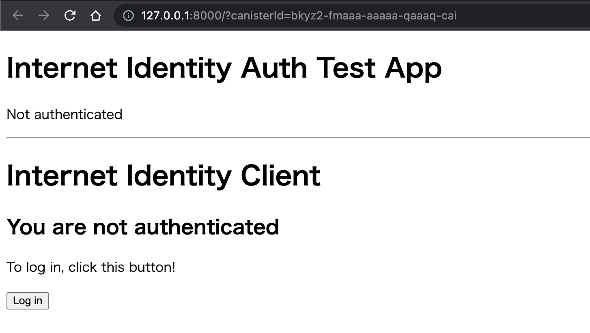

This is an [Internet Computer](https://internetcomputer.org/) and [Next.js](https://nextjs.org/) project with a simple authentication feature.

## Require
- dfx 0.14.0
- node ^16
- npm ^8 

## Getting Started

clone this repository and chenge directory to cloned directory.

```bash
git clone git@github.com:junkei-okinawa/ii_auth_with_nextjs.git
cd ii_auth_with_nextjs
```

First, run the development server for dfx:

```bash
dfx start --background
# Running dfx start for version 0.14.0
# Using project-specific network 'local' defined in /Users/# junkei/Documents/learning-rust/websocket_front/dfx.json
# WARN: Project-specific networks are deprecated and will be removed after February 2023.
# Dashboard: http://localhost:59369/_/dashboard
```

deploy app.
```bash
./dfx_deploy.sh
# ...
# Deployed canisters.
# URLs:
#   Frontend canister via browser
#     MyApp: http://127.0.0.1:8000/?canisterId=bkyz2-fmaaa-aaaaa-qaaaq-cai
```

Open MyApp URL.


Stop the development server.
```bash
dfx stop
```